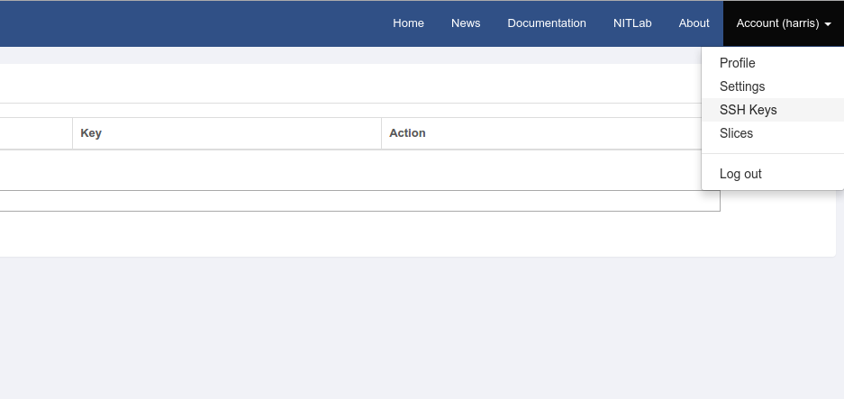

.. _accessing-nitos:

Accessing NITOS
===============

1.Creating a User Account
-------------------------

The first step you need to do before you can use NITOS is to create your NITOS account. This process is simple.

You should access the NITOS portal |nitos| and click the "Log in" button.

.. |nitos| raw:: html

   <a href="http://nitos.inf.uth.gr/" target="_blank">nitos.inf.uth.gr</a>

Underneath the login boxes, click the **“Create an account”** link. Fill in the required information. Once you click the **“Create My Account”** button, a confirmation mail will come to you.

*Example*:

#. Visit |nitos|
#. Click "Create an account"
#. | **Name**: Simos Iordanidis
   | **Username**: syiordan 
   | **Email Address**: syiordan@inf.uth.gr
   | **Password**: 1234
   | **Confirm Password**: 1234
   | **Account Description**: Mention your research activity/position in order to get your registration approved

#. Click "Create My Account". The administrator will approve the creation of your account.

.. warning:: The Account Description field is mandatory! Requests for accounts without an Account Description will be discarded.

You are ready! From now on, you are a member of NITOS.
   
.. _getting-slice:

2.Getting a Slice and Reserving Resources
------------------------------------------

All access to NITOS resources occurs through the “slice” abstraction.

In order to create a slice in NITOS you need to log in to NITOS Portal, click on the Account tab (in the top right of the screen) and select "slices". Then you need to specify the name of the new slice, together with a description of the experiment you are willing to conduct, using this slice.

Once your slice is ready, you can go to the |reservation-page| of the NITOS Portal and reserve nodes and frequencies for a given timeslot.

.. |reservation-page| raw:: html

   <a href="http://nitos.inf.uth.gr/reservation" target="_blank">Reservation page</a>

Slice names typically coincide with your NITlab webpage's account username. For example if your username is **"syiordan"**, then your slice's name will probably be **"syiordan"**. In the following topics, we will assume that your slice is named **username**. You should replace this value with your slice’s actual name whenever you encounter it.

.. _connecting-to-NITOS:

3.Connecting to NITOS Server
-----------------------------

You will need ssh public-key authentication to connect to the server of the NITOS testbed. If you do not already have a ssh keypair, or would like to create a new one specifically for NITOS, perform the following commands. We will assume that **~/.ssh/id_rsa** is the private key that you will use for NITOS authentication.

.. code-block:: bash

  $ ssh-keygen -t rsa -f ~/.ssh/id_rsa
	Generating public/private rsa key pair.
	Enter passphrase (empty for no passphrase):
	Enter same passphrase again:

Once you have created your ssh keypair, you will need to upload your public key to the NITOS server. You can do this easily through the NITOS Portal. Log in to the NITOS Portal and click on the Account tab (in the top right part of the screen) and select **“ssh-keys”**. 

Fill in a name for your key, paste the key in the corresponding field and after that, click **“add ssh key”**. You should see your key appearing in the list.

Open a secure shell to NITOS server using your slice name as username. You do not need a password if you have already uploaded your rsa public key in the server. You can log into the server at anytime you want. However, you can only access the nodes you booked through the Reservation page.

It's time to connect to NITOS Server! Depending on the resources you are going to use, you should connect to the corresponding server. For example:

For node001 - node040 (NITOS Outdoor Testbed) execute the following command:

.. code-block:: bash

	$ ssh slice_name@nitlab.inf.uth.gr

For node040 - node049 (NITOS Office Testbed) execute the following command:

.. code-block:: bash
	
	$ ssh slice_name@nitlab2.inf.uth.gr

For node050 - node093 (NITOS Indoor RF Isolated Tetstbed) execute the following command:

.. code-block:: bash
	
	$ ssh slice_name@nitlab3.inf.uth.gr

