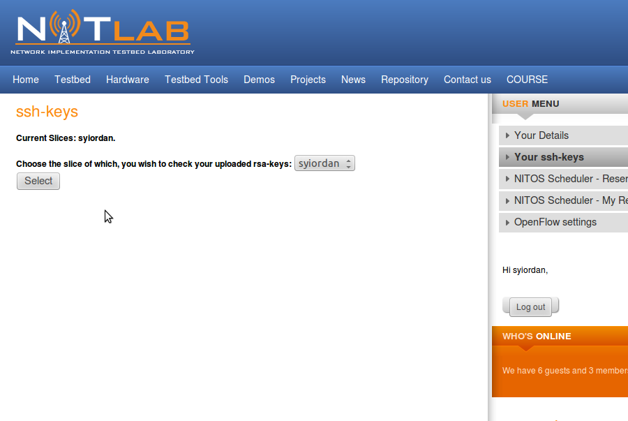

Connecting to NITOS Server
==========================

You will need ssh public-key authentication to connect to the Server in the NITOS testbed. If you do not already have a ssh keypair, or would like to create a new one specifically for NITOS, perform the following commands. We will assume that **~/.ssh/id_rsa** is the private key that you will use for NITOS authentication.

| **$ ssh-keygen -t rsa -f ~/.ssh/id_rsa**
| **Generating public/private rsa key pair.**
| **Enter passphrase (empty for no passphrase):** 
| **Enter same passphrase again:**

Once you have created your ssh keypair, you will need to upload your public key to the NITlab database. You can do this easily through the NITlab website. Go to the NITlab home-page and log in using your newly created account. In the User Menu on the right, click **“Your ssh-keys”**. Choose the slice to which you want to associate this public key, click **"Submit"** and after that, click **“Browse”** and navigate to your public key file **(i.e. ~/.ssh/id_rsa.pub).** Click **“Upload.”** You should see your key appearing in the list.

Open a secure shell to "nitlab.inf.uth.gr" (NITOS server) using your slice name as username. You do not need a password if you have uploaded your rsa public key in the server. You can log into the server at anytime you want to. However, you can only access the nodes you booked through the Reservation page.

It's time to connect to NITOS Server!
Perform the following command:

| **$ ssh slice_name@nitlab.inf.uth.gr**
| i.e *$ ssh syiordan@nitlab.inf.uth.gr*
