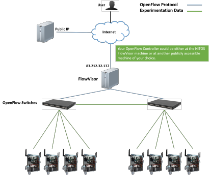

OpenFlow
=========

OpenFlow testbed- Topology
-----------------------------

NITOS facility provides remote access to OpenFlow switches, enabling the user to create an OpenFlow slice, related to an experiment slice that has already available. The OpenFlow slice is implemented by the FlowVisor, a Stanford's software tool that creates slices on the OpenFlow switches, enabling the parallel access to them by separate users. In a transparent way from the user perspective, the switches ports, which are used by the user's reserved nodes, are assigned to the user's OpenFlow slice. The whole process is orchestrated by the NITOS scheduler, configuring appropriately the FlowVisor at the beggining of a new reservation slot.

In summary, the remote user of the NITOS facility is able to reserve nodes for his slice (through the NITOS scheduler) and run an OpenFlow experiment with use of this slice. In particular, the testbed provides transparently an abstract OpenFlow switch for his slice, that conceptually is equivalent to a physical OpenFlow switch that includes only the ports of the nodes that he has reserved. The OpenFlow controller that defines the functionality of this abstract switch, should listen both on the host machine and the TCP port that are illustrated in the OpenFlow settings, in the User Menu on the right of the page (requires registration). The following figure illustrates the NITOS OpenFlow testbed topology, as well as the slicing mechanism.

OpenFlow settings
-----------------------
**Current Slices: syiordan.**

Along with the reservation of NITOS nodes, the related ports of the OpenFlow switches are also included in the corresponding experimentation slice. Please provide the IP address of the appropriate OpenFlow controller to perform an OpenFlow experiment with the use of this slice.

The current IP addresses of the OpenFlow controllers of each of your slices are depicted in the following table:

| syiordan
| IP:
| Port:

In case that one of the above IP addresses is 127.0.0.1, you can raise your OpenFlow controller at the NITOS FlowVisor server machine at 83.212.32.137. You are able to connect to the FlowVisor server machine through ssh, using the same ssh-keys that you use to connect to the NITOS server machine.
