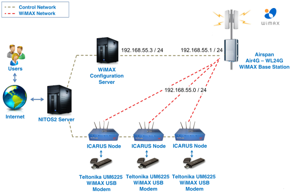

WiMAX
=================

1.Basics
----------
At the beggining, you will see how to connect and use the WiMAX testbed. You'll also see how to develop and run a simple experiment where the WiMAX interface is properly configured and how to generate traffic between two nodes.

2.Prerequisites
-----------------------
*Accessing/Provisioning Resources*
^^^^^^^^^^^^^^^^^^^^^^^^^^^^^^^^^^^^^

| **Accessing a Resource at NITOS**
|
| Firstly, you have to reserve a node at NITOS: :ref:`getting-slice`

| In order to use the WiMAX testbed resources offered by the NITOS facility, you will have to reserve the WiMAX Base Station (BS) and the nodes
  with WiMAX connectivity, offered by the testbed (**node041 until node049**).

| Reserving the BS will render rights to the experimenter to access the WiMAXrf services of the testbed, used to configure and setup the BS at the experimenter's will.

| *After your reservation has started, login to Server.*

.. warning:: You have to connect to **NITOS Server 2 nitlab2.inf.uth.gr**!

.. warning:: This section of the documentation is based in OMF 5.4!

You can use your NITOS account to access the NITOS Server 2. Just open a secure shell and write:

.. code-block:: bash

   ssh slice_name@nitlab2.inf.uth.gr

:Example: *i.e syiordan@nitlab2.inf.uth.gr*

| **Provisioning a Resource at NITOS**
|
| You can use the method described on :ref:`loading-omf` for instructions on how to load images on resources at NITOS. Load your resource with a disk image that is compatible for WiMAX experimentation such as **fgre_2014.ndz**. You can find `here <http://nitlab.inf.uth.gr>`_ all the available baseline images provided by NITlab.

In order to load a WiMAX enabled image at the office testbed please use the following command:

.. code-block:: bash

   omf load -t omf.nitos.node0XX -i baseline_wimax_teltonika.ndz

.. warning:: Please use the omf.nitos.node0XX hrn in order to address NITOS nodes located at the office testbed!!

3.Experimental Topology
-------------------------------
The topology we are examining in this tutorial is a central Base Station unit, able to route requests from an internal WiMAX network to the internet.

 * The Base Station is using the 192.168.55.10 IP address
 * Multiple clients use the 192.168.55.0/24 subnet to communicate with the Base Station
 * Packets routed through the Base Station are sent over the internet through a NAT translation

However, the devices that we currently use do not allow us to interface directly the WiMAX device. If you send the following command

.. code-block:: bash

   root@node044:~# ifconfig tel0

you will get an output similar to the following:

.. code-block:: console

   tel0     Link encap:Ethernet  HWaddr 00:1e:42:02:18:72
            inet addr:192.168.0.8 Bcast:192.168.0.255  Mask:255.255.255.0
            inet6 addr: fe80::21e:42ff:fe02:1872/64 Scope:Link
            UP BROADCAST RUNNING MULTICAST  MTU:1500  Metric:1
            RX packets:19939 errors:0 dropped:0 overruns:0 frame:0
            TX packets:325172 errors:0 dropped:0 overruns:0 carrier:0
            collisions:0 txqueuelen:1000
            RX bytes:6477672 (6.4 MB)  TX bytes:486501878 (486.5 MB)

Since the WiMAX devices need a rather complex configuration in order to allow access to the WiMAX interfaces of another node, you have to issue the following command:

.. code-block:: bash

   root@node044:~# wmxfix

4.Connecting to the WiMAX Network
----------------------------------
In order to connect to the Base Station, issue the following commands:

.. code-block:: bash

   wget --http-user admin --http-password admin -qO - "http://192.168.0.1/cgi/cli?stopSs"
   wget --http-user admin --http-password admin -qO - "http://192.168.0.1/cgi/cli?addChannel frequency=2590000 bandwidth=10"
   wget --http-user admin --http-password admin -qO - "http://192.168.0.1/cgi/cli?startSs"

The first one, instructs the dongle to disconnect from any network that it is attached on. The second command, instructs the dongle to use the WiMAX channel at 2590MHz with a 10MHz channel bandwidth. Finally, with the third command the dongle connects to the NITOS WiMAX network.
You can verify that the dongle has been connected, by sending the following command:

.. code-block:: bash

   ping 192.168.55.3

If the host responds, you are connected to the Base Station. Host 192.168.55.3 is the server behind the Base Station, responsible for configuring it and routing the traffic coming from it.

5.Set up experimentation properties of the BS
----------------------------------------------
Before starting an experiment with the WiMAX testbed, the user has to configure the BS with his/her desired parameters. There is a basic command
available to get or set the required parameters to the BS. This is the **'wget'** command.

As soon as the parameters are set, the experimenter can submit a new Experiment Definition(ED) written in OMF Experiment Description Language to the OMF's EC.

WiMAX services are seperated in two categories. The services of the first one are used to configure the BS and those of the other one are used to configure the mobile clients. A
description of these services is available to the user, through the command:

.. code-block:: bash

   wget -qO- "http://wimaxrf:5054/wimaxrf/"

Services for the BS
^^^^^^^^^^^^^^^^^^^^^^^
| **bs/arq**

  .. note :: Set ARQ parameters

| **bs/harq**

  .. note :: Set HARQ parameters

| **bs/security**

  .. note :: Set SECURITY parameters

| **bs/wireless**

  .. note :: Set WIRELESS parameters

| **bs/zone**

  .. note :: Set ZONE parameters

| The above services show to the experimenter a sort description relative to functionality of the service which provide , permitted values and
  the name of parameters which the user can configure and provision to bs.

| **bs/get**

  .. note :: Get Basestation Static Parameter

| **bs/set**

  .. note :: Set Basestation Static Parameter

| **bs/get** and **bs/set** are two functions which required the name of parameter and value in order to configure the Base station.

| For example if the user wants to change the transmission power of Base station to 40 db then he/she has to go to wireless service and there
  will find a parameter “txpower” .Then he/she has to write the wget command :

.. code-block:: bash

   wget -qO- " http://wimaxrf:5054/wimaxrf/bs/set?txpower=40 "

| If the user wants to know the current transmission power then the only change he/she has to do in wget is replace the bs/set with bs/get
  and obviously no value required .

.. code-block:: bash

   wget -qO- " http://wimaxrf:5054/wimaxrf/bs/get?txpower "

| **bs/default**

  .. note :: In order to setup the BS to the default settings.

| **bs/info**

  .. note :: Get information about the Base Station

| **bs/inservice**

  .. note :: Set Base Station in service state

| **bs/maintenance**

  .. note :: Set Base Station to maintenance state

| **bs/restart**

  .. note :: Restart the base station.

| **bs/status**

  .. note :: Get status of WiMAX RF service

Services for the mobile clients
^^^^^^^^^^^^^^^^^^^^^^^^^^^^^^^
| **mobileclient**

  .. note :: You can set/get MOBILE parameters using the mobileclient service only

| **mobileclient/monitor**

  .. note :: Get information about the mobile station

| **mobileclient/reregister**

  .. note :: Reregister Mobile station

| **mobileclient/showregister**

  .. note :: Get all registered mobiles stations

.. warning:: Once you have logged in, you should setup the base station to the default settings, as its configuration might have been altered from its normal behavior by any previous experimenter. 

| In order to setup the BS to the default settings you issue the following command:

.. code-block:: bash

   wget -qO- " http://wimaxrf:5054/wimaxrf/bs/default "

| Since not all of the changes take place immediately, you will need to restart the base station for some of the changes to take effect. You
  can restart the BS with the following command:

.. code-block:: bash

   wget -qO- " http://wimaxrf:5054/wimaxrf/bs/restart "

| Since the BS is back to its default settings, you can start experimenting with the WiMAX testbed.

6.Developing the experiment
----------------------------

To run an experiment with OMF, you first need to describe it into an Experiment Description (ED). An ED is a file/script that is supplied as an input to the Experiment Controller (EC). It contains a detailed description of the resources involved in an experiment and the sets of actions to perform in order to realize that experiment. An ED is written using the OMF Experiment Description Language (OEDL).

The ED for our experiment:

.. literalinclude:: wimax-ed.rb
   :language: ruby
   :linenos:

7.Running Experiment
---------------------
You can run it from the testbed server with the following command:

.. code-block:: bash

   omf-5.4 exec experiment.rb --slice your_username

**When running the EC with the above command, you should see an output similar to this :**

.. code-block:: console

   INFO NodeHandler: OMF Experiment Controller 5.4 (git 3105a52)
   INFO NodeHandler: Slice ID: ardadouk
   INFO NodeHandler: Experiment ID: ardadouk-2014-09-15t17.13.25+03.00
   INFO NodeHandler: Message authentication is disabled
   INFO Experiment: load system:exp:stdlib
   INFO property.resetDelay: resetDelay = 90 (Fixnum)
   INFO property.resetTries: resetTries = 1 (Fixnum)
   INFO Experiment: load system:exp:eventlib
   INFO Experiment: load wimax_experiment.rb
   INFO property.runtime: runtime = 20 (Fixnum)
   INFO property.client: client = "192.168.55.47" (String)
   INFO property.interval: interval = "1" (String)
   INFO property.sender: sender = "omf.nitos.node046" (String)
   INFO property.receiver: receiver = "omf.nitos.node047" (String)
   INFO Topology: Loading topology 'omf.nitos.node046'.
   INFO Topology: Loading topology 'omf.nitos.node047'.
   INFO Experiment: Switching ON resources which are OFF
   INFO ALL_UP_AND_INSTALLED: Event triggered. Starting the associated tasks.
   INFO exp: Request from Experiment Script: Wait for 50s....
   INFO exp: This is an iperf  experiment using a teltonika modem
   INFO exp: Request from Experiment Script: Wait for 20s....
   INFO exp: Request from Experiment Script: Wait for 2s....
   INFO exp: Request from Experiment Script: Wait for 2s....
   INFO EXPERIMENT_DONE: Event triggered. Starting the associated tasks.
   INFO NodeHandler:
   INFO NodeHandler: Shutting down experiment, please wait...
   INFO NodeHandler:
   INFO run: Experiment ardadouk-2014-09-15t17.13.25+03.00 finished after 1:20

8.Accessing Results
--------------------
You can access your results in /tmp file with sqlite3.

Type a command similar to this:

.. code-block:: bash

   ardadouk@nitlab2:~# sqlite3 /tmp/ardadouk-2014-09-15t17.13.25+03.00.sq3

.. code-block:: sql

   SQLite version 3.7.9 2011-11-01 00:52:41
   Enter ".help" for instructions
   Enter SQL statements terminated with a ";"
   sqlite> .dump
   PRAGMA foreign_keys=OFF;
   BEGIN TRANSACTION;
   CREATE TABLE _senders (name TEXT PRIMARY KEY, id INTEGER UNIQUE);
   INSERT INTO "_senders" VALUES('Sender',1);
   CREATE TABLE _experiment_metadata (key TEXT PRIMARY KEY, value TEXT);
   INSERT INTO "_experiment_metadata" VALUES('start_time','1410801183');
   CREATE TABLE "iperf_transfer" (oml_sender_id INTEGER, oml_seq INTEGER, oml_ts_client REAL, oml_ts_server REAL, "pid" INTEGER,
   "connection_id" INTEGER, "begin_interval" REAL, "end_interval" REAL, "size" UNSIGNED BIGINT);
   INSERT INTO "iperf_transfer" VALUES(1,1,1.12967199832201,-10720.634378,1305,4,0.0,1.0,132300);
   INSERT INTO "iperf_transfer" VALUES(1,2,2.11843899637461,-10719.670295,1305,4,1.0,2.0,130830);
   INSERT INTO "iperf_transfer" VALUES(1,3,3.11740499734879,-10718.671336,1305,4,2.0,3.0,130830);
   INSERT INTO "iperf_transfer" VALUES(1,4,4.11637899279594,-10717.672453,1305,4,3.0,4.0,130830);
   INSERT INTO "iperf_transfer" VALUES(1,5,5.11532099545002,-10716.673515,1305,4,4.0,5.0,130830);
   INSERT INTO "iperf_transfer" VALUES(1,6,6.11408699303865,-10715.674698,1305,4,5.0,6.0,130830);
   INSERT INTO "iperf_transfer" VALUES(1,7,7.12316399812698,-10714.665473,1305,4,6.0,7.0,132300);
   INSERT INTO "iperf_transfer" VALUES(1,8,8.12204399704933,-10713.666893,1305,4,7.0,8.0,130830);
   INSERT INTO "iperf_transfer" VALUES(1,9,9.120899990201,-10712.668072,1305,4,8.0,9.0,130830);
   INSERT INTO "iperf_transfer" VALUES(1,10,10.1199389994144,-10711.668989,1305,4,9.0,10.0,130830);
   INSERT INTO "iperf_transfer" VALUES(1,11,11.1189429908991,-10710.670015,1305,4,10.0,11.0,130830);
   INSERT INTO "iperf_transfer" VALUES(1,12,12.1177649945021,-10709.671234,1305,4,11.0,12.0,130830);
   INSERT INTO "iperf_transfer" VALUES(1,13,13.1268289983273,-10708.662183,1305,4,12.0,13.0,132300);
   INSERT INTO "iperf_transfer" VALUES(1,14,14.1257529854774,-10707.663297,1305,4,13.0,14.0,130830);
   INSERT INTO "iperf_transfer" VALUES(1,15,15.1244789958,-10706.664623,1305,4,14.0,15.0,130830);
   INSERT INTO "iperf_transfer" VALUES(1,16,16.1233379840851,-10705.66573,1305,4,15.0,16.0,130830);
   INSERT INTO "iperf_transfer" VALUES(1,17,17.1221949756145,-10704.66691,1305,4,16.0,17.0,130830);
   INSERT INTO "iperf_transfer" VALUES(1,18,18.1109179854393,-10703.678253,1305,4,17.0,18.0,130830);
   INSERT INTO "iperf_transfer" VALUES(1,19,19.1300239861012,-10702.659141,1305,4,18.0,19.0,132300);
   INSERT INTO "iperf_transfer" VALUES(1,20,20.1187719702721,-10701.670474,1305,4,19.0,20.0,130830);
   COMMIT;

